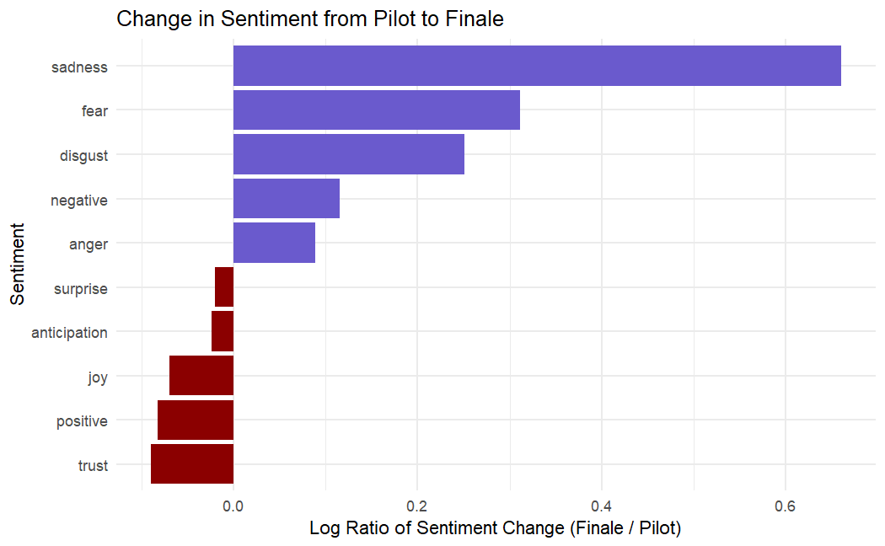

# Time Series & Text Analyses

- [View Time Series Analysis of Fish Passage in the Willamette Falls dam.](https://snakekn.github.io/HW4/HW4T1.html)
- [View Text Analysis of The Ultimatum (2023).](https://snakekn.github.io/HW4/HW4T2.html)

**What I learned, and the type of analysis I can quickly support:**
- **Language**: R
- **Data Analysis Methods:** Time Series ([tsibble](https://cran.r-project.org/web/packages/tsibble/index.html), [fable](https://cran.r-project.org/web/packages/fable/index.html), [feasts](https://cran.r-project.org/web/packages/feasts/index.html)), and Text Sentiment.
- **Other Activities:**: Regex ([stringr](https://cran.r-project.org/web/packages/stringr/index.html)), Text Analysis ([textdata](https://cran.r-project.org/web/packages/textdata/index.html)), Reading in PDFs ([pdftools](https://cran.r-project.org/web/packages/pdftools/index.html)), Creating Wordclouds ([ggwordclouds](https://cran.r-project.org/web/packages/ggwordclouds/index.html)).

### Sentiment Shift from Pilot To Finale (The Ultimatum)

